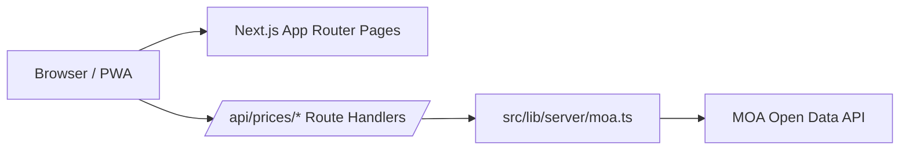

# Vercel Deployment Architecture

## 目標

此專案的正式執行環境是 Vercel，因此必須採用單一 Next.js 部署拓樸，不再依賴額外常駐的 Express API 服務。

## 執行拓樸

## 請求流程

1. 使用者從首頁、搜尋頁或作物詳情頁發出請求。
2. 前端一律呼叫同網域的 `/api/prices/*`。
3. Route Handlers 透過 `src/lib/server/moa.ts` 呼叫農業部 API。
4. 共用資料層處理 ROC/ISO 日期轉換、逾時中止、資料正規化與休市日補點。
5. 若外部 API 失敗，端點會回傳明確錯誤訊息與狀態碼，前端顯示空狀態或重新載入入口。

## Route Handlers 對照

| Route | 用途 | 回傳策略 |
| --- | --- | --- |
| `/api/prices` | 搜尋與列表頁資料 | 回傳聚合後均價、交易量與真實 `priceChange` |
| `/api/prices/overview` | 首頁市場總覽 | 以當日與前一日資料計算均價/量能變化 |
| `/api/prices/overview/trend` | 首頁市場週趨勢 | 回傳最近數日的市場均價走勢 |
| `/api/prices/movers` | 首頁波動榜 | 以今日/昨日資料比對最大波動作物 |
| `/api/prices/markets` | 作物跨市場比價 | 回傳同一作物在不同市場的即時均價與漲跌 |
| `/api/prices/history` | 作物歷史走勢 | 正常回傳 `data`、`closedDays`；失敗時回傳錯誤與空資料 |

## 休市日與圖表策略

- `fetchMarketData` 會生成完整日期序列。
- 無資料日期會標記為 `isClosed: true`，並將均價/交易量設為 `null`。
- 前端 `PriceLineChart` 已啟用 `connectNulls`，所以休市日只會留下提示，不會讓折線斷裂。

## Vercel 部署重點

- `next.config.ts` 不再把 `/api/*` rewrite 到外部 Express 服務。
- `next-env.d.ts` 必須存在，確保 Next 型別與 build pipeline 完整。
- `SITE_URL` 會優先讀取 `NEXT_PUBLIC_SITE_URL`，否則回退到 Vercel 提供的專案網址。
- `MOA_FETCH_TIMEOUT_MS` 建議設定在 Vercel function 可承受的時間內，預設 10 秒。

## 維護建議

- 新增 API 端點時，優先擴充 `src/lib/server/moa.ts`，避免在 Route Handler 內重複寫 fetch 與日期轉換。
- PWA 快取策略如需調整，請優先修改 `public/sw.js`，避免把快取邏輯散落到 React 元件內。
- 使用者偏好若要新增欄位，請同步更新 `src/lib/preferences.ts` 與 `src/app/globals.css` 的套用規則。